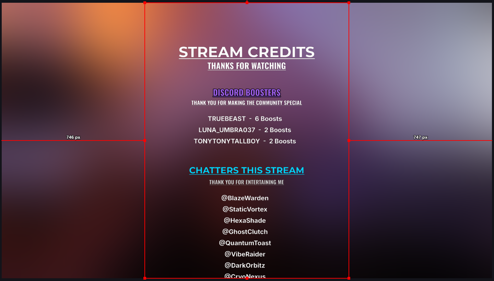
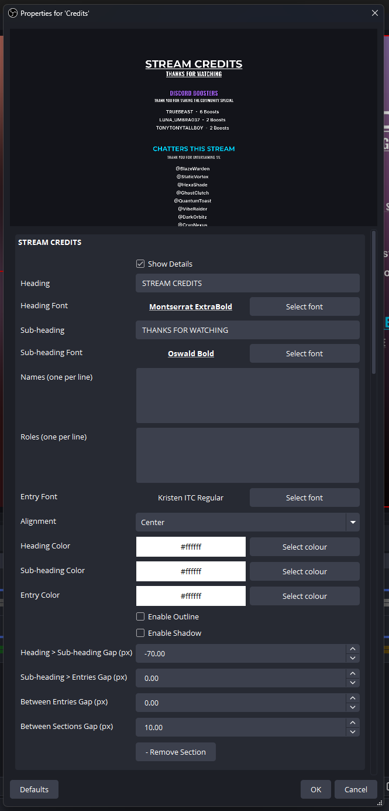
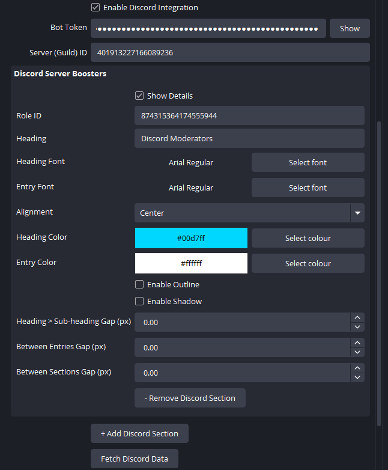
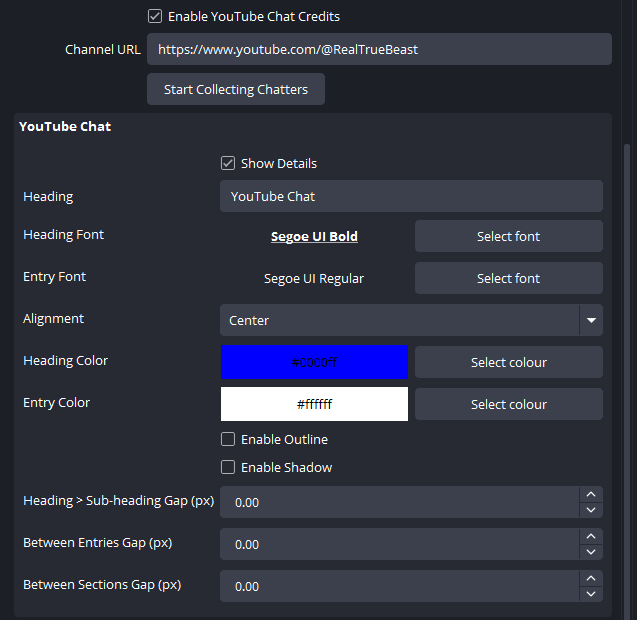

# Credits Plugin

A fully customizable scrolling credits source plugin for OBS Studio with Discord and YouTube live chat integration. Add professional end credits to your streams - with live chatter names populated automatically.

> **Note:** This is a third-party plugin and is not affiliated with or endorsed by the OBS Project.



## Features

- **Scrolling credits roll** - Smooth, GPU-accelerated vertical scroll with configurable speed
- **Dynamic sections** - Add/remove as many sections as you need, each fully customizable
- **Per-section styling** - Fonts, colors, alignment, outline, shadow, and spacing per section
- **Discord integration** - Auto-fetch server members by role on scene switch
- **YouTube live chat** - Collect unique chatter names during your stream (no API key needed)
- **Hotkeys** - Start/Restart, Pause/Resume, Stop via hotkeys
- **Start & loop delays** - Configurable delays before scrolling and between loops
- **Flicker-free updates** - Two-layer rendering for seamless live data updates

## Screenshots

### Manual Sections
Add headings, sub-headings, names, and roles with individual font pickers and full styling controls.



### Discord Integration
Fetch server members by role ID. Auto-fetches when you switch to the credits scene.



### YouTube Live Chat
Paste your channel URL and chatters are collected automatically during your stream.



## Installation

### Windows

1. Download the latest installer from [Releases](https://github.com/KiernenIrons/credits-plugin/releases)
2. Close OBS Studio
3. Run the installer (requires admin)
4. Open OBS Studio and add a **"Credits"** source

## Usage

1. In OBS Studio, click **+** under Sources
2. Select **Credits**
3. Add sections with headings, names, and roles
4. Customize fonts, colors, outline, shadow, and spacing per section
5. Optionally enable Discord and/or YouTube chat integration
6. Switch to the credits scene at the end of your stream

### Discord Setup

1. Create a bot at https://discord.com/developers/applications
2. Enable **Server Members Intent** (privileged)
3. Invite bot with scope `bot` and permission `1024`
4. In the plugin: enter Bot Token, Guild ID, and add Discord sections with Role IDs
5. Click **Fetch Discord Data** or switch to the scene (auto-fetches)

### YouTube Chat Setup

1. Enable **YouTube Chat Credits** in the plugin properties
2. Paste your channel URL (e.g. `https://youtube.com/@yourchannel`)
3. Click **Start Collecting Chatters** or just start streaming - it auto-detects
4. Unique chatter names populate live and clear at each stream start

### Hotkeys

Bind these in **Settings > Hotkeys**:
- **Start/Restart Credits** - Reset and start scrolling
- **Pause/Resume Credits** - Freeze/unfreeze at current position
- **Stop Credits** - Stop and reset to beginning

## Building from Source

### Requirements

- OBS Studio 30+ (tested with 32.1.0)
- CMake 3.16+
- Visual Studio 2022 Build Tools (Windows)
- OBS Studio source code (for headers)

### Build

```bash
cmake --preset default
cmake --build build --config Release
```

## Reporting Issues

Please open an issue on this repository to report bugs or request features.

## AI Disclaimer

This plugin was developed with the assistance of AI coding tools (Claude Code / Claude Opus 4.6 by Anthropic). The AI was used as a development tool throughout the creation process. All code has been reviewed and tested by the author.

## Author

**Kiernen Irons** - Design, development, and maintenance.

## License

This plugin is licensed under the GNU General Public License v2.0 or later, in compliance with the OBS Studio licensing requirements.

See [LICENSE](LICENSE) for details.
